# How to debug the Angular portal

## About this guide
This guide shows how to debug Angular portal code in VSCode. It assumes that you already have a running Angular portal development environment (VSCode, cloned Angular repository, OIM installation, etc.).
The examples will show how to start debugging the "Submit" button in the Angular portal shopping cart with the Firefox browser. It uses version 9.2.1, but the steps will be similar in other versions.
The main body of the guide will focus on the necessary steps to enable debugging. Detailed explanations and links to additional resources are collected in a separate chapter at the end of the guide. Links to the relevant subchapters are included in the guide.

## Setup

### Cloned repository
After setting up VSCode and cloning the Angular portal repository, the folder `IdentityManager.Imx` should be open in VSCode, with the folder `imxweb` inside it:

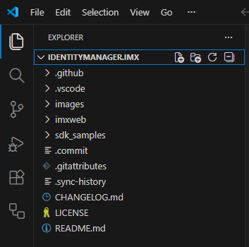

After cloning the repository, switch to branch `v92` or create a new branch from it.

Build all modules and the portal application. 

### Create a launch configuration file and edit the launch configuration

#### Copy the launch configuration file
To enable debugging, copy the file `IdentityManager.Imx\imxweb\.vscode\launch.json` to `IdentityManager.Imx\.vscode\launch.json`.
This file contains different launch configurations that can be used for debugging. You can either use one of the included configurations or add your own.

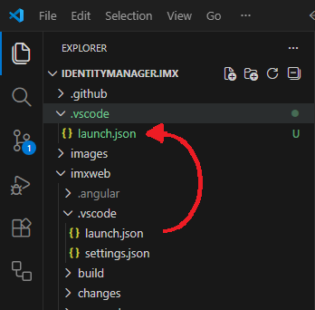

see: [Why not use the original file?](#WhyCopyDebugConfig)

#### Fix webRoot and add path mappings
The copied file needs some changes to actually work. In the first entry:

1. Change the line `"webRoot": "${workspaceFolder}"` to `"webRoot": "${workspaceFolder}/imxweb"`.

2. Add path mappings for all modules in which you want to debug. For this guide, this is the `qbm` module, which requires the following addition to the launch configuration:

``` json
"pathMappings": [
{
    "url": "webpack:///projects/qer/src/lib",
    "path": "${workspaceFolder}/imxweb/projects/qer/src/lib"
}
]
```

 If you want to debug code from other modules, add corresponding mappings for those modules. (see [Adding path mappings]({#AddPathMappings}))

#### Finished launch configuration

The launch configuration should look like this:

``` json
    {
      "type": "firefox",
      "request": "launch",
      "reAttach": true,
      "name": "QER App Portal (Firefox)",
      "url": "http://localhost:4200/",
      "webRoot": "${workspaceFolder}/imxweb",
      "pathMappings": [
        {
          "url": "webpack:///projects/qer/src/lib",
          "path": "${workspaceFolder}/imxweb/projects/qer/src/lib"
        }
      ]
    }
```


### Adding debugging support for browsers {#ExtensionDebuggerForFirefox}
VSCode does not have ootb support for Firefox as a debugging browser. Support for different browsers can be added by installing a VSCode extension.

Firefox debug support can be added with the extension `Debugger for Firefox`, created by Mozilla. It can be downloaded from the [Visual Studio Marketplace](https://marketplace.visualstudio.com/items?itemName=firefox-devtools.vscode-firefox-debug) or installed through the VSCode Extension menu.

> <font color=red><b>
> Always be careful when adding extensions to VSCode. Only install extensions from trustworthy sources!
</b></font>

## Breakpoints
Breakpoints allow you to halt the execution of code. While the execution is halted, you can inspect variables, execute code line-by-line or continue the execution.
To set a breakpoint, navigate to the corresponding file and set a breakpoint on an executable line in the source code by clicking in the empty area left of the line numbers. A red dot will appear, showing the newly set breakpoint.

For this guide, we will set a breakpoint on the first line of the function `submitShoppingCart()` in the file `imxweb\projects\qer\src\lib\shopping-cart\shopping-cart.component.ts`.  This function is called when the button "Submit" is clicked in the portal's shopping cart.

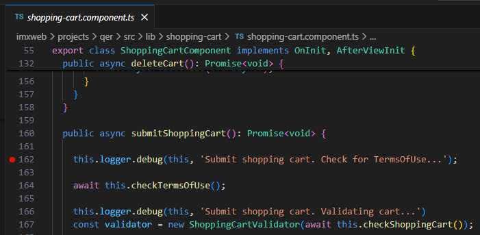

## Starting the debugger
1. Start a local imxclient

2. start the web portal on the local imxclient: `npm run start qer-app-portal`. Wait until the application is running.

3. Switch to the `Run and Debug` view in VSCode. The dropdown at the top offers all start configurations that are defined in the `launch.json` file.

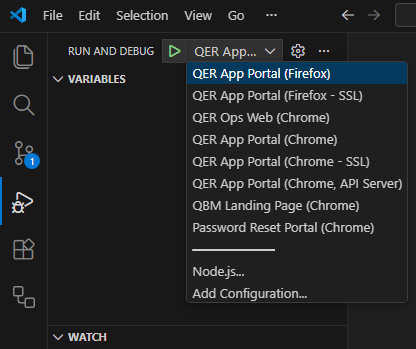

Select `QER App Portal (Firefox)` and click the green triangle next to the dropdown to start debugging. This will open a new Firefox window and load the Angular Portal start page from the local imxclient. The address bar will be highlighted and showing a robot symbol if the debugger has been connected correctly to the browser.

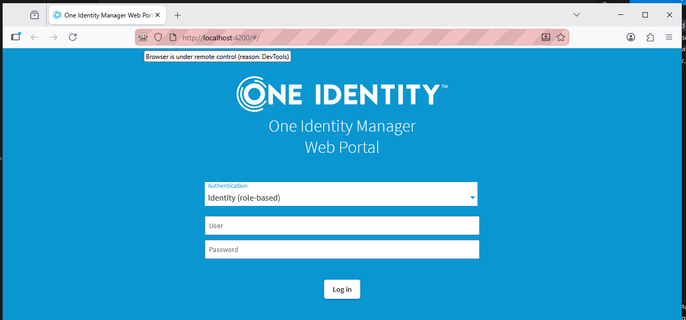

If the login page is not loaded, switch to VSCode.

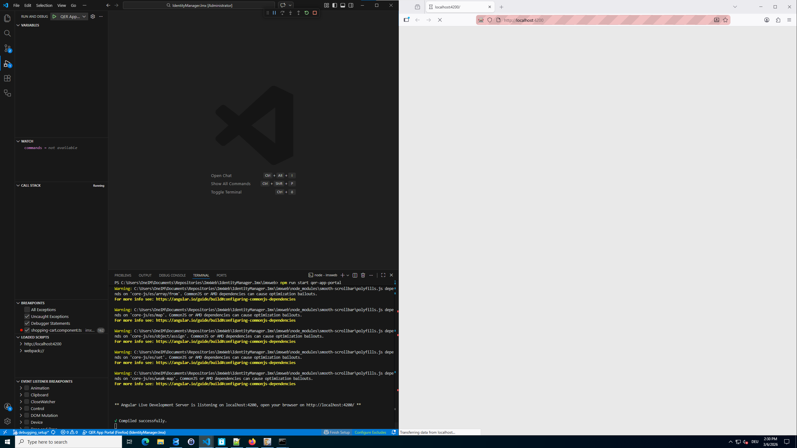

 Click the `Pause` button on the debugger tool bar:

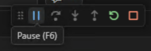

Then click the `Continue` button:

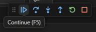

This resolves an error where a dependency cannot be found and the login page will be loaded.

## Reaching a breakpoint and stepping through code
Since the breakpoint was set on the function `submitShoppingCart()`, we need to start a product request and submit it, to actually execute the function.
Log into the portal with, add a product and navigate to the shopping cart.

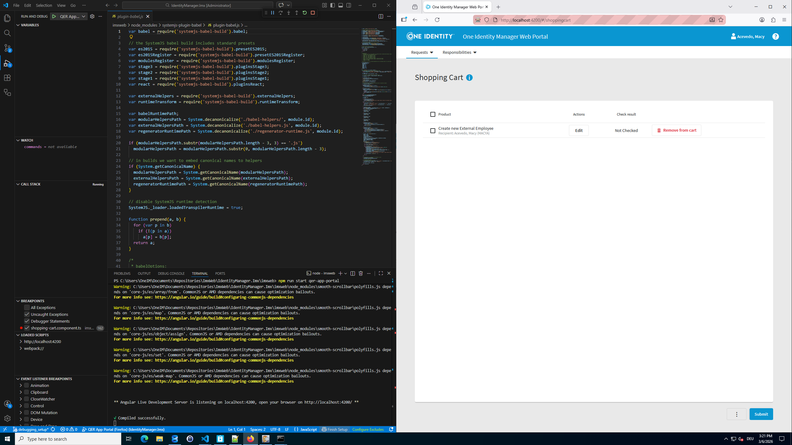

Click on the `Submit` button in the shopping cart. This will execute the function `submitShoppingCart()`. Because a breakpoint is set on the first line of that function, the execution will be paused on this line. VSCode will automatically show the source file and highlight the line on which the execution was paused. Firefox will display a message to show that the execution was paused by the debugger.

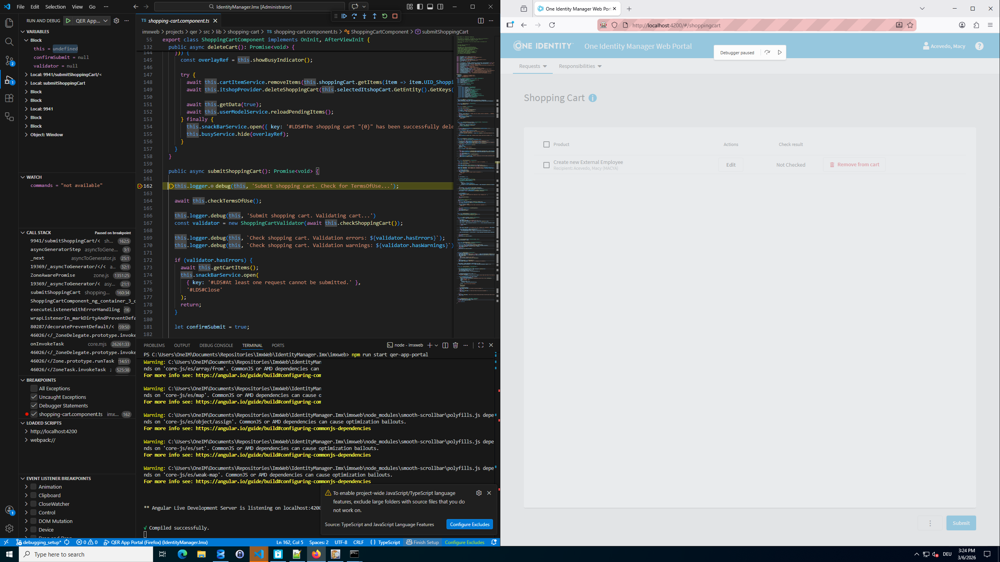

You can now do the usual debugger actions (stepping through the code line by line, inspecting variable values, etc.).

## Ending a debug session
After you are done with your debugging, you can end the session by closing the debug browser window or clicking the `Stop` button.

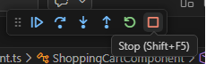

# Explanations and resources

## Explanations

### Why are we using a copy of the debug config file instead of the original file? {#WhyCopyDebugConfig}

VSCode expects a project's debug configuration at the relative path `.\.vscode\launch.json` inside the project folder. The actual project folder of the Angular Portal is `.\imxweb` inside the repository folder. This is why it already contains a prepared `launch.json` file.
You can open the `imxweb` folder directly in VSCode, and use the existing configuration instead of copying it. The downside is that the `imxweb` folder is not a complete git repository. This means that you would need to switch to the `IdentityManager.Imx` folder whenever you want to use git functionality (committing to your local repository, pushing to the remote repository, etc.).

By copying the file once, you can use the debugger and git without switching the working directory.

### Adding path mappings {#AddPathMappings}
Path mappings are required by the compiler to match compiled code to the corresponding source files. They are part of debug configuration in your `launch.json` file.
You can add path mappings manually for each file, but if you are using the extension `Debugger for Firefox`, they can be created automatically. (see: [Adding debugging support for browsers]({#ExtensionDebuggerForFirefox}))
To do this, open a source file after you have started a debugging session and add a breakpoint. If no path mapping exists for this file, the breakpoint will be shown as `Unverified breakpoint` and the `Debugger for Firefox` plugin will offer to automatically create the required path mapping and add it to the debug configuration.

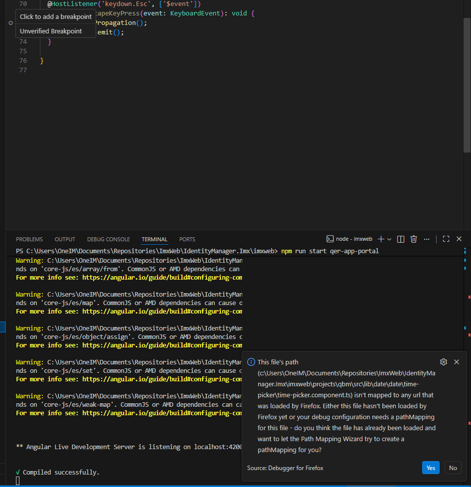

If you click `Yes` in the message box, the path mapping will be added to the debug configuration.

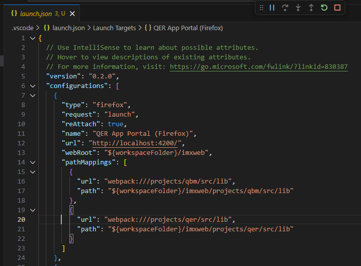

After adding the path mapping, you need to restart the debug session.