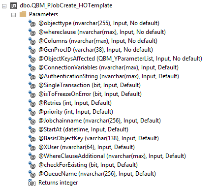
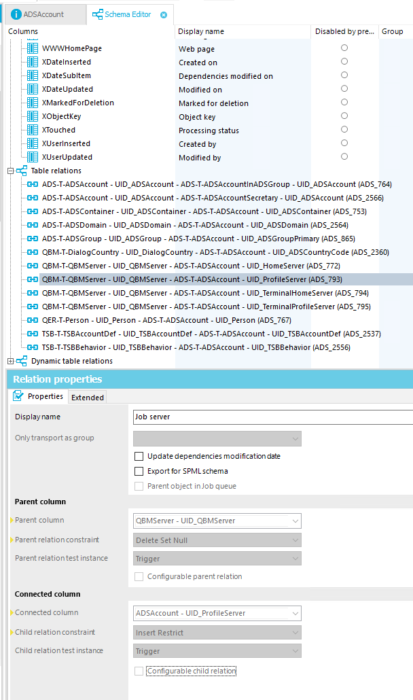

# Useful Stored Procedures in OneIM databases

Besides tables and views, the One Identity Manager database also contains a number of stored procedures. These procedures are used by OneIM, but can also be used by a developer or operator. This article shows the most useful stored procedures and how to use them.

## How to use stored procedures

### Calling Stored Procedures

Stored Procedures are SQL statements that can be executed outside of a normal (SELECT, INSERT, UPDATE, DELETE) SQL statement. To do so, any SQL tool which can execute SQL statements can be used, e.g. MS SQL Studio or the ObjectBrowser.

Calling a stored procedure is done with the `exec` keyword, the name of the stored procedure and any necessary parameters that are passed to the stored procedure. For a stored procedure CCC_MyStoredProc without any parameters, the call looks like this:

```sql
exec CCC_MyStoredProc
```

### Stored Procedure Parameters
#### Providing parameter values

Stored procedures can have zero, one or more parameters. Parameters can be mandatory or optional.

> <details><summary>About "optional" parameters</summary>
> None of the stored procedures in an OneIM database has true optional parameters. Instead, for some parameters a default value is defined in the stored procedure. If no value is provided for such a parameter when calling the stored procedure, the default value is used. In practice, any parameter with a default value can be handled as optional and a value only needs to be provided if the default value does not lead to the intended behavior.
> </details>
<br>
As an example, below is a screenshot of the parameters of the stored procedure QBM_PJobCreate_HOTemplate, as displayed in SQL Studio. It has several mandatory parameters (marked “No default”) and several optional parameters (marked “Default”). The screenshot also shows the parameters' data types. Parameters can accept any value fitting the data type, as well as NULL (if the stored procedure can handle NULL values).



In the following examples, QBM_PJobCreate_HOCallMethod will be called with only the mandatory parameters, to show the difference between identifying parameters by name and by position.

To identify parameters by position, the parameter values have to be provided in the exact same order as they are defined in the stored procedure. (The SQL Studio shows parameters in this order.)

Calling QBM_PJobCreate_HOCallMethod with positional parameters would look like this (ignoring optional parameters to keep this short):

```sql
exec QBM_PJobCreate_HOUpdate 'Person', 'IsInactive = 0', 'CentralAccount', 'abc-01234-def-56789', NULL
```

To identify parameters by name, the name of the parameter has to be included in the call:

```sql
exec QBM_PJobCreate_HOUpdate @objecttype = 'Person', @whereclause = 'IsInactive = 0', @Columns = 'CentralAccount', @GenProcID = 'abc-01234-def-56789', @ObjectKeysAffected = NULL
```

The values can also be provided in any order, since the parameter to which the value is assigned is now only determined by the provided parameter name:

```sql
exec QBM_PJobCreate_HOUpdate @GenProcID = 'abc-01234-def-56789', @whereclause = 'IsInactive = 0', @Columns = 'CentralAccount', @ObjectKeysAffected = NULL, @objecttype = 'Person'
```

Both methods can be mixed. Since the mandatory parameters are usually defined as the first parameters of a stored procedure, these are often identified by position. Optional parameters are then defined by name. In the following example, the optional parameter `@priority` is provided in addition to the mandatory parameters:

```sql
exec QBM_PJobCreate_HOUpdate 'Person', 'IsInactive = 0', 'CentralAccount', 'abc-01234-def-56789', NULL, @priority = 0
```

Identifying `@priority` by name is necessary, because otherwise its value `0` would be assigned to the parameter `@ConnectionVariables` by its position.

#### Common parameters in OneIM stored procedures

There are some parameters that are used by many of the stored procedures. These will be described here, to avoid repeating them for each stored procedure.

|Parameter|Usage|Example|
|---|---|---|
|@objecttype|name of the table storing the object that you want to manipulate|`exec QBM... @objecttype = 'Person`|
|@whereclause|SQL where clause that determines which objects in the table specified in @objecttype will be manipulated|`exec QBM... @whereclause = 'IsInactive = 0'`|
|@GenProcID|process tracking id| manually selected value:<br>`exec QBM... @GenProcID = 'myGenProcID'`<br>generated UUID:<br>`declare @myID nvarchar(38) = newid()`<br>`exec QBM... @GenProcID = @myID`|

#### Additional values as parameter pairs

Some stored procedures require additional parameters beside the mandatory parameters. Although these parameters are defined as optional parameters, the stored procedure will not work without them.

An example is the stored procedure QBM_PJobCreate_HOUpdate, which is used to update entries in the database. Since the procedure is generic and can be used for any table, you need to provide parameters which determine the updated attributes and the new values. To do so, there are parameter pairs `@p1/@v1`, `@p2/@v2`, ... up to `@p31/@v31` . The `@pX` parameter has to contain the name of the attribute while `@vX` contains the new value. For example, to update the Primary Department, Primary Costcenter and CustomProperty01 for all active identities, the following command would be used:

```sql
declare @myID nvarchar(38) = newid()
exec QBM_PJobCreate_HOUpdate 'Person', 'IsInactive = 0', @myID, @p1 = 'UID_Department', @v1 = '12345-abc-67890-def', @p2 = 'UID_ProfitCenter', @v2 = '09876-fed-54321-cba', @p3 = 'CustomProperty01', @v3 = 'updated manually due to error in HR sync'
```

The order in which the attributes are assigned to the parameters does not matter. Providing the column name and value for CustomProperty01 in the `@p1/@v1` parameter pair would work just as well.

#### Additional values as positional parameters

Some stored procedures require additional parameters that are passed on to other functions. These stored procedures provide parameters `@param1` up to `@param10`. These parameters are positional, they need to be provided in the same order as the called function expects them.

An example is the stored procedure QBM_PJobCreate_HOCallMethod. Since it can be used to call any object method and each object method expects different parameters, the values for the object method parameters need to be passed in the `@paramX` parameters. In this example, the method CreateAttestation will be called to create a new attestation case. It requires the XObjectKey of the attestation object as its first (and only) parameter, so it will be passed as `@param1`: 

```sql
declare @genProcID nvarchar(38) = newid(); -- generates a new UUID to use as process tracking id
exec QBM_PJobCreate_HOCallMethod 'AttestationPolicy', 'UID_AttestationPolicy = ''829dfe1c-eadb-4b50-a3bb-ea669476b415''', 0, 'CreateAttestation', @genProcID, @param1='<Key><T>Person</T><P>a1f576f3-cbc4-4042-9dbc-938b8d6561d9</P></Key>' -- create a job in the JobQueue to run the object method
```

## About OneIM Stored Procedures

### Naming conventions

**<font color="red">Note: This naming convention is not documented by One and has been derived from the existing stored procedures. Use with caution!</font>**

Stored procedures in a OneIM database follow a naming convention. The stored procedure QBM_PJobCreate_HOTemplate will serve as an example. The underscores will be ignored, since they only serve to increase the readability of the name.

|Name part|Usage|Notes|
|---|---|---|
|QBM|Module identifier|Identifies which module a stored procedure belongs to, in this case the “Quest Base Module”. Other modules have different identifiers, e.g. “LDP” for the LDAP module.|
|PJobCreate|Type and Function|The first letter is the type of stored procedure.<br>P: creates processes in the JobQueue<br>R: reads data from the database<br>Z: starts DBQueue calculations<br>After the first letter, the actual task is given<br>JobCreate: Creates a new process in the JobQueue|
|HOTemplate|Process component|Only exists for stored procedures that insert Jobs into the JobQueue, indicates the process component and process task that will be executed.<br>The first letters indicate the process component; in this case HO for HandleObjectComponent.<br>The remaining letters indicate the process task that will be executed; in this case ExecuteTemplates.|

The name QBM_PJobCreate_HOTemplate thus tells us the following:

* The stored procedure will be available in all OneIM installations, since it is part of the QBM module

* It will create a new process entry in the JobQueue table, which will be executed by a job server

* The started process will execute the process task ExecuteTemplates from the HandleObjectComponent process component

The parameter values determine which objects will be affected and which templates will be recalculated for these objects.

<details>
<summary>Generated stored procedures</summary>
Some stored procedures have the module identifier GEN, which indicates an automatically generated stored procedure. These procedures are often used to provide functionality for custom elements, such as updating Dashboard contents. These will never be called directly, only from other stored procedures.
</details>

## Useful Stored Procedures

While most stored procedures in an OneIM database will only be used by OneIM, some of them can be useful for different tasks.

Most of the time, the biggest advantage of using a stored procedure is the possibility to manipulate objects while still triggering the object layer. While data changes can be done with SQL, these changes will not trigger the object layer, meaning that templates will not be triggered, processes will not be started and XUserUpdated and XDateUpdated will not be updated. Using a stored procedure that creates a process in the JobQueue that executes these changes ensures that all following actions (templates, triggering processes, etc.) will take place.

Using the stored procedures also allows the easy handling of large numbers of objects. While it is possible to select and manipulate multiple objects at once in Manager or ObjectBrowser, there are limits to this. Selecting and changing more than a few hundred objects will either directly lead to a program crash or take a very long time (during which there is absolutely no feedback to the user, making this indistinguishable from a program crash). With stored procedures, such changes can be delegated to the job service, which can handle the load. Additionally, most of these procedures parallelize the execution if there is a large number of objects, reducing the execution time.

Sometimes, a stored procedure is the only way to execute a certain task, for example aborting a request or attestation. This is done through object methods which can only be executed by the job service. With the correct stored procedure, processes can be created in the JobQueue, avoiding this problem.

*Note: All mandatory parameters will be described. Optional parameters will only be described if necessary. Common parameters (even if mandatory) will not be described, check above for a description of these parameters.*

### QBM_PJobCreate_HOCallMethod

#### Function

Calls an object method for one or more objects.

#### Example use cases

* cancelling requests
* starting attestations

#### Parameters
|Parameter|Usage|
|---|---|
|@MethodName|name of the object method|

#### Example

The example starts an attestation for a single object (in this case an identity). To do so, the method `CreateAttestation` is called for the `AttestationPolicy` object that defines the attestation. The attestation object is identified by the object key passed to the optional parameter `@param1`.

The value for the parameter @genProcID is generated beforehand, since the function newid() cannot be passed as a parameter.

```sql
-- the method CreateAttestation requires an additional parameter containing the XObjectKey for which the attestation will be started 
declare @genProcID nvarchar(38) = newid(); -- generates a new UUID to use as process tracking id
exec QBM_PJobCreate_HOCallMethod 'AttestationPolicy', 'UID_AttestationPolicy = ''829dfe1c-eadb-4b50-a3bb-ea669476b415''', 0, 'CreateAttestation', @genProcID, @param1='<Key><T>Person</T><P>a1f576f3-cbc4-4042-9dbc-938b8d6561d9</P></Key>' -- create a job in the JobQueue to run the object method
```

### QBM_PJobCreate_HODelete

#### Function

Deletes objects from the database, triggering the object layer. The generated process will not delete the object if this would violate referential integrity in the database (eg. an identity cannot be deleted if it has product requests).

<details><summary>References and deletion</summary>
Not all references prevent the deletion of the referenced object. References that are defined with the parent relation constraint `Delete Restrict` (for example ADSAccount.UID_Person) will prevent the deletion of the referenced object. Other constraints will allow the deletion.

The constraint for a reference can be checked in the Designer in the schema editor:


</details>

#### Example use cases

#### Parameters
This stored procedure only uses the common parameters. Objects will be deleted from the table given in parameter `@objecttype`, selected by the whereclause in parameter `@whereclause`.

#### Example

```sql
-- delete all ESets marked for deletion in CustomProperty01
declare @genProcID nvarchar(38) = newid();
exec QBM_PJobCreate_HODelete 'ESet', 'CustomProperty01 = ''delete me''', @genProcID
```

### QBM_PJobCreate_HOInsert

#### Function

Inserts new objects into the database, triggering the object layer. On insertion, all relevant templates will be calculated and processes (if defined for event INSERT on the table) will be generated in the job queue.

#### Example use cases

Inserting objects that were selected from another data source (different table or database).

#### Parameters
|Parameter|Usage|
|---|---|
|@objecttype|table into which the new entries are inserted|
|@genProcID|process tracking ID|

Additionally, parameter pairs @pX/@vX need to be provided for each attribute of the inserted object.

#### Example

```sql
-- create a new ESet
declare @genProcID nvarchar(38) = newid();
exec QBM_PJobCreate_HOInsert 'ESet', @genProcID, @p1='Ident_ESet', @v1='ExampleInsert', @p2='IsForITShop', @v2=1, @p3='Commentary', @v3='Automatically created'
```

### QBM_PJobCreate_HOUpdate

#### Function

Updates all entries in a table that are selected by the provided whereclaus

#### Example use cases

Mass manipulation of data, for example:

* changing business roles to a new business role class
* updating objects or attributes that cannot be updated through the GUI, but require triggering the object layer

#### Parameters

This stored procedure uses the common parameters. Additionally, the updated value(s) need to be provided as parameter pairs.

#### Example

```sql
-- move all Orgs in OrgRoot "abc" to OrgRoot "def"
declare @genProcID nvarchar(38) = newid();
exec QBM_PJobCreate_HOUpdate 'Org', 'UID_OrgRoot = ''abc-123''', @genProcID, @p1='UID_OrgRoot', @v1='def-456'
```

### QBM_PJobCreate_HOTemplate

#### Function

Executes templates for all selected objects in a table.

#### Example use cases

Executing templates after objects have been manipulated without triggering the object layer, or where the template was changed but no recalculation has happened yet for existing object


#### Parameters

This stored procedure uses the common parameters. Additionally, the columns for which the templates will be executed have to be provided in the parameter `@Columns`.

#### Example

```sql
-- calculate new CentralAccount for all active identities
declare @genProcID nvarchar(38) = newid();
exec QBM_PJobCreate_HOTemplate 'Person', 'IsInactive = 0', 'CentralAccount', @genProcID
```

### QBM_PJobCreate_HOFireEvent

#### Function

Generate events for large number of objects.

#### Example use cases

Starting processes for multiple objects.

#### Parameters

This stored procedure uses the common parameters. Additionally, the event name needs to be provided in the parameter `@EventName`.

#### Example

```sql
-- start all synchronizations at once
declare @genProcID nvarchar(38) = newid();
exec QBM_PJobCreate_HOFireEvent 'DPRProjectionStartInfo', '1=1', 'RUN', @genProcID
```

### QBM_PDBQueueInsert_Single

#### Function

Insert tasks to DB queue.

#### Example use cases

* start recalculations for identities
* recalculate approvers for requests or attestations

#### Parameters

This stored procedure uses the common parameters. Additionally, you need to know the task you want to insert to DB queue (e.g. ATT-K-AttestationHelper) and the UID of the object that will be handled by the task.

#### Example

```sql
-- recalculate attestation approvers for an attestation case
Declare @genProcID varchar(38) = newid();
exec QBM_PDBQueueInsert_Single 'ATT-K-AttestationHelper', 'uid-of-attestation-case', '', @genProcID
```